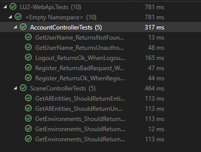
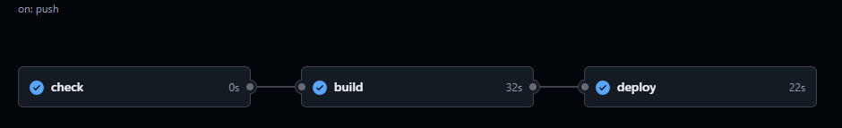

# Avans HBO Jaar 1, Periode 3: ATIx ICT-B1.3 2D-Graphics and Secure-Communication LU2(2024-25)
- (30-01-2025 / 12-03-2025)
- C#, Azure, Unity, Postman, MSTests

## Project Overview
Dit is het derde project van mijn Informatica-opleiding. Het project bestaat uit een individueel en een groepsdeel. Dit is het individuele deel (LU2).

De opdracht: een eigen API ontwikkelen waarmee we data kunnen ophalen, bewerken en opslaan. Vervolgens wordt de API in de cloud geplaatst en gebruikt in een Unity front-end.
- **Unity gedeelte(frontend)**, folder: `LU2-Unity`
- **API gedeelte(backend)**, folder: `LU2-WebApi`
- **MSTests(testen)**, folder: `LU2-WebApi.Tests`

Elke van deze onderdelen krijgt een aparte sectie waarin ik het verder behandel in deze README.

Preview:

- [Opdracht periode](Assets/Opdrachtbeschrijving.pdf)
- [Start ERD](Assets/Erd_db.PNG)

## Beveiliging
Om extra aandacht te geven aan een van de grotere onderwerpen van deze periode, namelijk beveiliging, heb ik naast verschillende aanvullende veiligheidsmaatregelen (zoals HTTPS, rate-limiting en andere technieken) ook online tests uitgevoerd om te verifiëren hoe goed mijn API-verbinding beveiligd is. Zie deze hieronder de scores van deze test:

Natuurlijk waren de resultaten niet meteen perfect, maar ik heb mijn applicatie zodanig aangepast dat deze nu wel aan de vereiste beveiligingsnormen van deze testen voldoet!

---

## Applicatiestructuur/Functionaliteit/Demo

### Frontend(Unity):
Er zijn 4 verschillende "Scenes" in Unity waar je toegang toe hebt:
- Login/Register scherm
- Wereld selector scherm
- Wereld scherm (de editor)
- Share selector (overzicht van met jou gedeelde werelden)

**1. Login/Register scherm**
- Bij alle schermen waar je niet ingelogd bent, word je automatisch teruggestuurd naar het login scherm.
- Hier kun je inloggen of registreren. De naam moet uniek zijn en het wachtwoord moet voldoen aan bepaalde eisen.
- Nadat je succesvol bent ingelogd, wordt het Wereld selector scherm ingeladen. Ook heb je via een instellingen knop de keuze voor een logout.

**2. Wereld selector scherm**
- Na inloggen kun je kiezen uit al bestaande werelden of nieuwe werelden aanmaken.(Maximaal 5 werelden kunnen tegelijkertijd bestaan per user.)
- Werelden worden gepresenteerd als planeten met de wereld namen. Als je minder dan 5 werelden hebt, zullen de overgebleven plaatsen gelabeld worden als "create world".
- Wanneer je op "create world" klikt, kun je een naam kiezen en een nieuwe wereld aanmaken.

**3. Wereld scherm (de editor)**
- Als je op een planeet klikt, word je doorgestuurd naar de editor, waar je de zojuist geklikte wereld kunt bewerken.

In de editor heb je verschillende opties:
- Verwijder de wereld inclusief objecten.
- Deel de wereld met anderen.
- Plaats of bewerk objecten in de wereld. **(Wijzigingen worden pas doorgevoerd wanneer je op de "Opslaan" knop drukt. Anders gaan de wijzigingen verloren.)**

Objecten plaatsen en bewerken:
- Klik op een object in de menubalk om het toe te voegen aan de wereld.
- Sleep het object naar de gewenste locatie.
- Gebruik `+` en `-` om de grootte van het object aan te passen.
- Gebruik `R` om het object te roteren.
- Wanneer je het object loslaat, wordt het geplaatst in de wereld.
- `Dubbelklikken` op een object verwijdert het **(let op: pas bij opslaan wordt het object echt verwijderd).**

**4. Share selector (overzicht van gedeelde werelden)**
- Als je een wereld hebt gedeeld, is deze zichtbaar voor anderen in de Share selector.
- Via de Wereld selector kun je naar dit overzicht navigeren.
- In dit overzicht zie je alle werelden die met jou gedeeld zijn.
- Als je op een gedeelde wereld klikt, laad je deze in de editor, maar met 
- Je kunt de gedeelde wereld alleen bekijken, niet bewerken. (De editor opties zijn uitgeschakeld voor gedeelde werelden.)

---

### Backend(C# API):
Lokaal gebruik ik SwaggerUI om de functionaliteiten van mijn API helder en overzichtelijk weer te geven:

Hierboven staan alle API-calls. Alles werkt op basis van de User-ID, wat betekent dat je geen omgevingen van andere gebruikers kunt ophalen, tenzij deze expliciet met jou zijn gedeeld. Zelfs dan kun je ze alleen bekijken, niet bewerken.

**Voorbeeld:** Het ophalen van scenes gebeurt op basis van de User-ID. Een gebruiker kan alleen zijn eigen (maximaal 5) werelden ophalen. Is de gebruiker niet ingelogd? dan krijg je een melding dat je geen rechten hebt.

- **Code voor de api staat in de folder: `/LU2-WebApi`**

---

### Tests(MSTests & Postman):
Ook het testen van de API was een belangrijk onderdeel deze periode. Ik heb gebruik gemaakt van verschillende manieren om te testen:
- MSTests
- Postman

**MSTests:**

Met MSTests heb ik verschillende specifiekere functies getest, zie hieronder:

Dit zijn de tests die automatisch worden uitgevoerd wanneer ik de code naar GitHub push. Als alle tests slagen, wordt de API gedeployed naar Azure en komt deze online. _Hieronder een korte samenvatting van de tests_:

- _GetUsername_ (return: NotFound/Unauthorized): Controleert of je een gebruikersnaam kunt ophalen zonder ingelogd te zijn. Dit test indirect alle rechten, aangezien een gebruiker zonder inlog geen enkele actie kan uitvoeren.

- _Logout_ (return: OK): Melding dat de gebruiker is uitgelogd (test dus het uitloggen)

- _Register_ (return: BadRequest/OK): Test eerst met onjuiste invoer, wat een BadRequest zou moeten opleveren. Vervolgens wordt een correcte invoer getest, waarbij een OK-melding bevestigt dat het account succesvol is aangemaakt. Hiermee wordt het registratieproces gevalideerd.

- _GetAllEntities_ (return: OK/Unauthorized): Checked of de entities(objecten) goed terugkomen, en of de gebuiker hier ook de rechten voor heeft.

- _GetEnvironments_: Test 3 keer of de gebruiker zijn environments kan ophalen, niet ingelogd(dus geen rechten): foutmelding, ook test het voor andere foutmeldingen. Is de gebruiker wel ingelogd? dan heeft de gebruiker rechten en geeft het een OK terug.

Als alle tests goed terugkomen met de verwachte input wanneer het gepushed is naar github zou dit het resultaat van de pipeline moeten zijn:

**Postman:**

Voor Postman heb ik een collectie gemaakt die vrijwel de hele applicatie doorloopt en doet testen. Eerst controleert deze of de gebruiker is ingelogd. Als dat zo is, wordt de gebruiker eerst uitgelogd om inconsistente resultaten te voorkomen. Vervolgens logt de gebruiker in, voert alle taken uit en verwijdert daarna de zojuist aangemaakte taken. Tot slot wordt de gebruiker weer uitgelogd.

Elke test waarbij een item wordt aangemaakt, heeft een script dat het ID opslaat, zodat het later direct weer verwijderd kan worden. Zo blijft er geen onnodige data in de database achter na het testen.

Je kunt deze collectie natuurlijk ook uitvoeren zonder het inloggedeelte. Dan zie je direct dat de gebruiker geen acties kan uitvoeren vanwege een gebrek aan rechten!

Voor een visuele weergave van alle tests, zie hieronder:

Script:

Let op, het script/collection hieronder bevat geen wachtwoorden of andere zaken vanwege beveiligingsredenen, met deze gegevens werkt het script wel.
- [Postman test-collection](Assets/LU2-WebApi.postman_collection.json)

Het test result lever ik in maar zet ik niet op de repo.

---